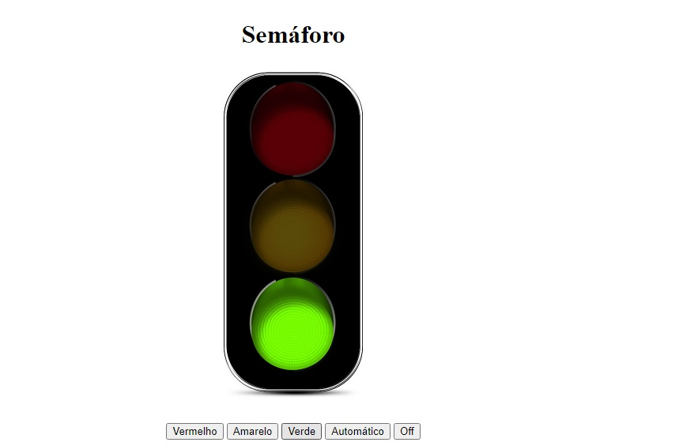

<h1 align="center"> Semáforo </h1>

Semáforo com botões dinâmicos para cada cor do sinal, botão desliga e botão que alterna cores automaticamente, feitos em JavaScript puro.  

  <a href="#-tecnologias">Tecnologias</a>&nbsp;&nbsp;&nbsp;|&nbsp;&nbsp;&nbsp;
  <a href="#-layout">Layout</a>&nbsp;&nbsp;&nbsp;|&nbsp;&nbsp;&nbsp;
  <a href="#memo-licença">Licença</a>

  

 

  

## 🚀 Tecnologias

Esse projeto foi desenvolvido com as seguintes tecnologias:

- HTML e CSS
- JavaScript
- Git e Github 

## Licença

Esse projeto está sob a licença MIT.

---

Desenvolvido por Renato de Paula(https://discord.com/channels/renatodepaula#7601)